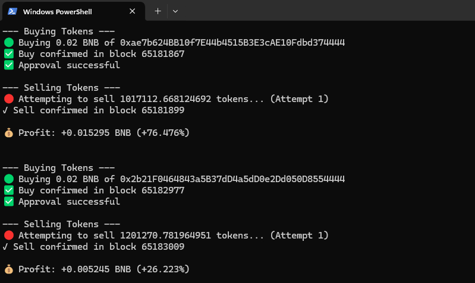

# 🚀 Four.Meme Trading Bot

An automated BNB-based trading bot that listens for new token launches on BNB Smart Chain and performs instant buy/sell actions using the [FourTrading SDK](https://github.com/FNZERO/four-trading-sdk).

Powered by Node.js and Ethers.js, fully configurable via `.env`.


---

## ⚙️ Features

- ✅ Automatic token buying on launch
- 🔁 Configurable delayed sell with retries
- 💸 Gas price control & slippage protection
- 📈 Real-time profit/loss tracking
- 🔐 Private key and RPC settings managed via `.env`

---

## 📦 Installation

```bash
git clone https://github.com/0xkiiven/fourmeme-trading-bot.git
cd fourmeme-trading-bot
npm install
````


---

## 🚧 Configuration

- Rename `.env.example` to `.env`

- Edit `.env` and fill in your details:

```env
PRIVATE_KEY=your_wallet_private_key
RPC_HTTP_URL=http://your.rpc.node:8545
WSS_URL=ws://your.ws.node:8546
FOUR_CONTRACT_ADDRESS=0x5c952063c7fc8610FFDB798152D69F0B9550762b
BUY_AMOUNT=0.02
SELL_DELAY=15
GAS_PRICE=0.11
APPROVE_GAS_PRICE=0.11
SELL_SLIPPAGE_PERCENTAGE=100
ONLY_BUY=false
```

---

## 🚀 Run the Bot

```bash
npm start
```

The bot will start listening for new token launches and begin trading based on your config.

---

## 📁 Project Structure

```
.
├── src/
│   ├── main.js          # Entry point
│   ├── abi.js           # FourMeme Abi
│   ├── trade.js         # Trading logic
│   └── config.js        # Environment-based config
├── .env.example         # Sample env file
├── package.json
└── README.md
```

---

## 🛑 Disclaimer

> This tool is provided for **educational and experimental purposes only**.
> Use it at your own risk. The authors are not responsible for any losses.


---
